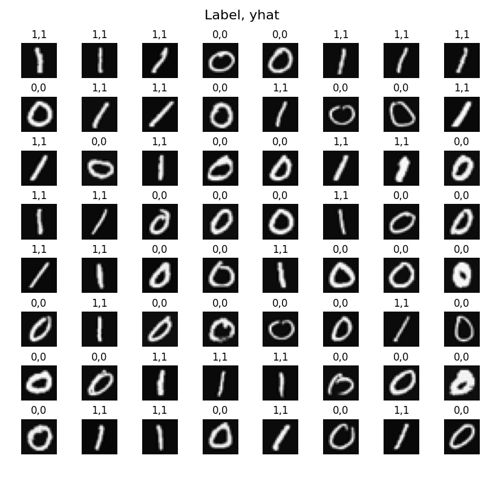
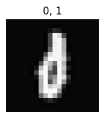
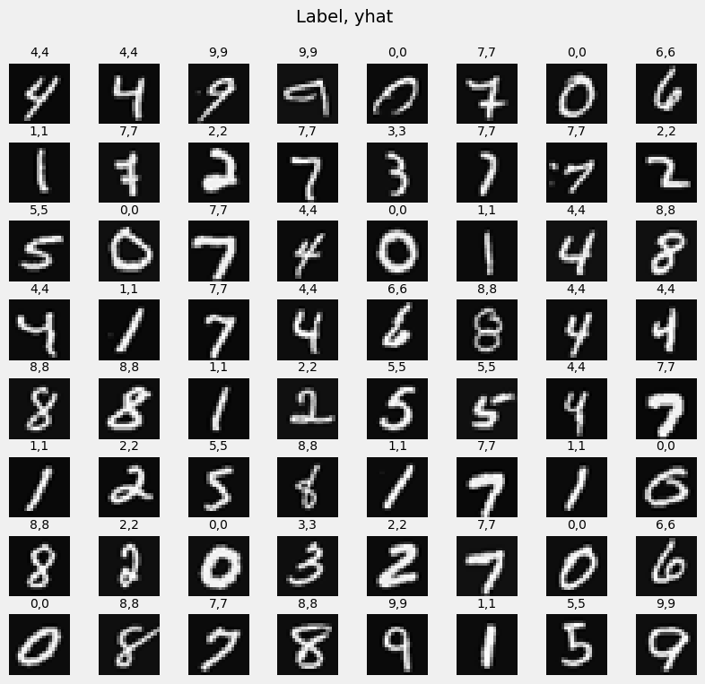
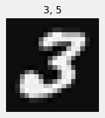
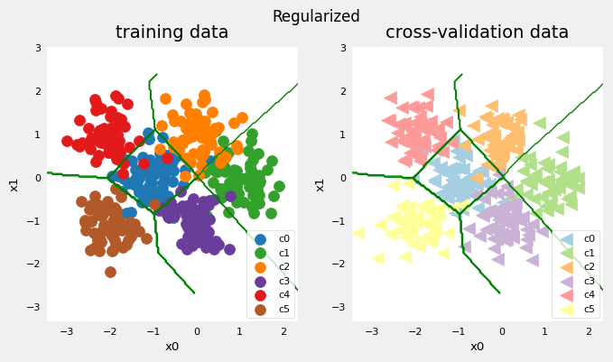
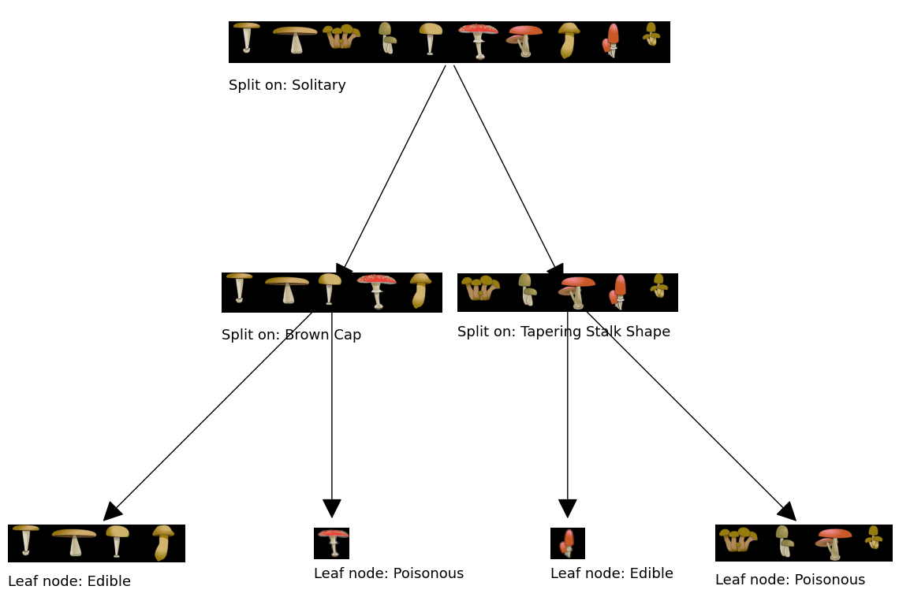
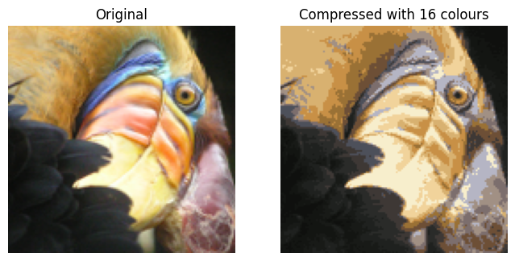
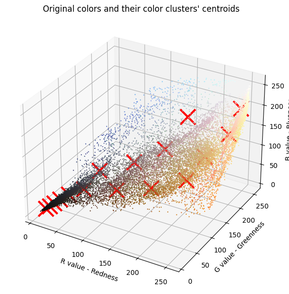
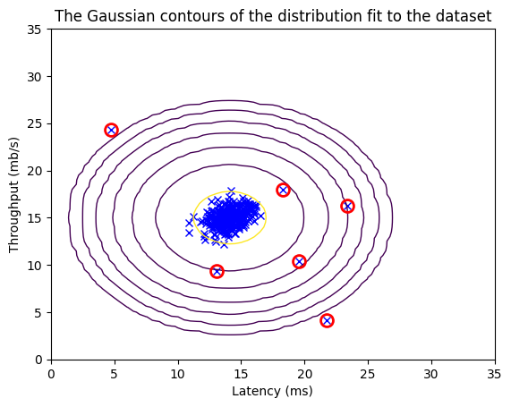

# Machine Learning Specialization

Due to historical reasons, this repository contains materials from two courses: 'Machine
Learning' offered by Stanford University and the
['Machine Learning Specialization'](https://www.deeplearning.ai/courses/machine-learning-specialization/)
offered by DeepLearning.AI. While the original link to the 'Machine Learning' course
offered by Stanford in 2015 is no longer available, all relevant materials have been
preserved within this repository.

## Description

### Machine Learning Specialization

#### C1W2A1: [Linear Regression](https://htmlpreview.github.io/?https://github.com/lionlai1989/machine-learning/blob/master/DeepLearningAI/C1-Supervised_Machine_Learning_Regression_and_Classification/W2A1-Linear_Regression/C1_W2_Linear_Regression.html)

**Linear regression** is one of the most widely used algorithms for predicting a wide
range of phenomena in fields like economics, social sciences, and engineering. It
achieves this by providing **continuous** predictions. This section provides everything
we need to know to implement a linear regression algorithm from the ground up. It
presents how to select an appropriate regression model, define a cost function, and
build a batch gradient descent approach to optimize a regression model.

<div style="text-align:center">
  
  <p style="font-size: 14px; color: #777;">Linear regression fits samples with one feature.</p>
</div>

#### C1W3A1: [Logistic Regression](https://htmlpreview.github.io/?https://github.com/lionlai1989/machine-learning/blob/master/DeepLearningAI/C1-Supervised_Machine_Learning_Regression_and_Classification/W3A1-Logistic_Regression/C1_W3_Logistic_Regression.html)

Although linear regression is good at predicting continuous values, it's not the ideal
choice for tasks that require **discrete** outcomes, like **classification problems**.
In such cases, we turn to **logistic regression**, an algorithm that's better suited to
handling discrete predictions. In this section, it shows how to build a logistic
regression model from scratch and address the issue of overfitting by introducing a
regularization term into the logistic cost function, ensuring the accuracy of models
during inference.

<div style="text-align:center">
  
  <p style="font-size: 14px; color: #777;">Logistic regression is employed to establish a decision boundary for two-feature samples by introducing polynomial terms as augmented features derived from the original two features.</p>
</div>

#### C2W1A1: [Neural Networks for Handwritten Digit Recognition, Binary](https://htmlpreview.github.io/?https://github.com/lionlai1989/machine-learning/blob/master/DeepLearningAI/C2-Advanced_Learning_Algorithms/W1A1-Neural_Networks_for_Handwritten_Digit_Recognition_Binary/C2_W1_Assignment.html)

In the first week of Course 2, it introduced the essential theoretical concepts and
implementation details required for building a multiple layer perceptron (MLP) network
from scratch. As a practical exercise, I constructed a simple three-layer MLP for
classifying handwritten digits '0' and '1.' Essentially, this MLP behaves similarly to
logistic regression, producing a single scalar output of either '0' or '1,'
differentiating between exactly two classes. While the model's performance was nearly
perfect, it did encounter a specific challenge in correctly classifying a '0' with a
narrow middle section.

<div style="text-align:center">
  
  
  <p style="font-size: 14px; color: #777;">Left: A three-layer MLP distinguishes between handwritten '0' and '1' images with high
accuracy. Right: The model encounters difficulty in correctly classifying a narrow '0',
mistakenly identifying it as '1'.</p>
</div>

#### C2W2A1: [Neural Networks for Handwritten Digit Recognition, Multiclass](https://htmlpreview.github.io/?https://github.com/lionlai1989/machine-learning/blob/master/DeepLearningAI/C2-Advanced_Learning_Algorithms/W2A1-Neural_Networks_for_Handwritten_Digit_Recognition_Multiclass/C2_W2_Assignment.html)

This week introduced additional activation functions and multi-class and multi-label
classification, including the softmax function to handle multiple classes' outputs. I
extended the concept by implementing a three-layer MLP capable of recognizing
handwritten digits spanning from '0' to '9.' Although the model's overall performance
remained nearly perfect, it encountered a specific challenge when classifying '3,' which
exhibited a slight skew.

<div style="text-align:center">
  
  
  <p style="font-size: 14px; color: #777;">Left: A three-layer MLP distinguishes between handwritten '0' to '9' images with high
accuracy. Right: The model encounters difficulty in correctly classifying a skewed '3',
mistakenly identifying it as '5'.</p>
</div>

#### C2W3A1: [Advice for Applying Machine Learning](https://htmlpreview.github.io/?https://github.com/lionlai1989/machine-learning/blob/master/DeepLearningAI/C2-Advanced_Learning_Algorithms/W3A1-Advice_for_Applying_Machine_Learning/C2_W3_Assignment.html)

This week, Andrew introduces techniques that enhance the performance of machine learning
algorithms through optimization. These techniques include evaluating and adjusting
algorithms to address bias and variance issues using regularization. Additionally, he
explores training procedures, setting performance benchmarks, and adopting an iterative
development approach. Furthermore, he introduces error analysis, data augmentation and
synthesis, and the utilization of transfer learning for rapid development. Finally, he
emphasizes the importance of fairness and ethics in machine learning models and
introduces precision-recall measures and the F1 score for effective evaluation.

<div style="text-align:center">
  
  
  <p style="font-size: 14px; color: #777;">The first image illustrates that a complex neural network tends to overfit the training data, resulting in poor performance on the validation data. However, this issue can be mitigated by introducing regularization into the training process (cost function), as demonstrated in the second image.</p>
</div>

#### C2W4A1: [Decision Trees](https://htmlpreview.github.io/?https://github.com/lionlai1989/machine-learning/blob/master/DeepLearningAI/C2-Advanced_Learning_Algorithms/W4A1-Decision_Trees/C2_W4_Decision_Tree_with_Markdown.html)

This week, Andrew took a detour from discussing neural networks and dived into the
theory and practical details of building a decision tree from scratch. Essentially,
decision trees split data using an entropy function to measure data purity. These trees
not only handle binary features but also accommodate multiple categories and even
continuous valued features. Additionally, the session introduced a regression tree
capable of predicting continuous values, similar to linear regression. However,
recognizing the limitations of a single decision tree, tree ensembles were introduced.
The discussion expanded to cover bagged decision trees, the random forest algorithm, and
XGBoost. Finally, the session briefly explores the scenarios for using neural networks
versus decision trees.

<div style="text-align:center">
  
  <p style="font-size: 14px; color: #777;">A simple decision tree is used to classify whether a mushroom is edible or poisonous.</p>
</div>

#### C3W1A1: [K-means Clustering](https://htmlpreview.github.io/?https://github.com/lionlai1989/machine-learning/blob/master/DeepLearningAI/C3-Unsupervised_Learning_Recommenders_Reinforcement_Learning/W1A1-K_means_Clustering/C3_W1_KMeans_Assignment.html)

Course 1 and 2 show the fundamentals of supervised learning. In course 3, we will
explore unsupervised learning, where data lacks labels, and our aim is to extract hidden
insights within this unlabeled data. In this segment, Andres provides a comprehensive
introduction to the K-means algorithm, which I then implement from scratch. One
application of K-means is image compression, demonstrated in the left image below, where
an image is compressed using only 16 colors (clusters). The right image illustrates the
distribution of RGB pixels in a 3D space, with the red crosses marking the centers of
these 16 clusters.

<div style="text-align:center">
  
  
  <p style="font-size: 14px; color: #777;">Left: 16 colors (clusters) are used to compress a bird image. Right: Pixels distribution in RGB 3D space with red crosses marking the 16 clusters' centroids.</p>
</div>

#### C3W1A2: [Anomaly Detection](https://htmlpreview.github.io/?https://github.com/lionlai1989/machine-learning/blob/master/DeepLearningAI/C3-Unsupervised_Learning_Recommenders_Reinforcement_Learning/W1A2-Anomaly_Detection/C3_W1_Anomaly_Detection.html)

In supervised learning, neural networks or logistic regressions are commonly employed to
discern the decision boundary between positive and negative examples. However, what if
our training dataset contains only a limited number of positive examples, representing
abnormal data? In such cases, where positive examples are sparse in the training
dataset, a viable approach is to construct a **generative model** focused on the
negative examples. This generative model calculates the probability of a new example
$x_\text{text}$, denoted as $p(x_\text{text})$, being classified as negative.
Consequently, the generative model can be used to detect anomaly in a system. For
instance, when presented with a new example $x_\text{text}$, if the computed probability
$p(x_\text{text})$ exceeds a predefined threshold, we can confidently categorize the
example as belonging to the negative class. Conversely, if $p(x_\text{text})$ falls
below the threshold, it signifies that $x_\text{text}$ deviates from the negative
examples, indicating an anomaly.

It's crucial to highlight that the Gaussian distribution is used for modeling the data
in this section. Thus, it is desirable for the input features to exhibit a more or less
Gaussian distribution. In cases where the input features deviate from Gaussian
distribution, it is necessary to apply specific operations for transformation. For
instance, a logarithmic transformation can be applied to the input features to transform
non-Gaussian features into more or less Gaussian distributed. However, it's worth
considering alternative distributions that may better capture the characteristics of the
features. For example, if the input feature involves quaternion data, opting for the
**von Mises-Fisher** distribution might be more appropriate than adhering strictly to
the Gaussian distribution.

<div style="text-align:center">
  
  <p style="font-size: 14px; color: #777;">The anomalous data, depicted as blue crosses encircled by red circles, are identified based on their probabilities falling below a predetermined threshold.</p>
</div>

### Machine Learning Stanford

#### [Linear Regression]()

#### [Logistic Regression]()

#### [Multi-class Classification]()

#### [Neural Networks]()

#### [Regularized Linear Regression and Bias v.s. Variance]()

#### [Support Vector Machines]()

#### [K-means clustering and Principal Component Analysis]()

#### [Anomaly Detection and Recommender Systems]()

## Getting Started

All the results in Jupyter Notebook can be reproduced by following the instructions
below.

### Dependencies

Before you start, you need to make sure you have the following dependencies installed:

-   **Python-3.10:** Python-3.10 is used throughout all the solutions to the problems.

### Downloading

-   To download this repository, run the following command:

```shell
git clone https://github.com/lionlai1989/machine-learning
```

### Install Python Dependencies

-   Create and activate a Python virtual environment

```
python3.10 -m venv venv_machine_learning && source venv_machine_learning/bin/activate
```

-   Update `pip` and `setuptools`:

```
python3 -m pip install --upgrade pip setuptools
```

-   Install required Python packages in `requirements.txt`.

```
python3 -m pip install -r requirements.txt
```

### Running Jupyter Notebook

Now you are ready to go to each Jupyter Notebook and run the code. Please remember to
select the kernel you just created in your virtual environment `venv_machine_learning`.

## Contributing

Any feedback, comments, and questions about this repository are welcome. However, I will
politely decline all pull requests or merge requests. This repository is a record of my
learning journey, and I aim to maintain its independence.

## Authors

[@lionlai](https://github.com/lionlai1989)

## Version History

-   2.0.0
    -   Working on the course, Machine Learning Specialization, in 2023.
-   1.0.0
    -   Finish all the problems in the course of Machine Learning Stanford by 2015.

## Reference

-   Please also install `graphviz` if you want to plot pretty graph (optional).

```
sudo apt-get install graphviz
```

-   Disable annoying tensorflow DEBUG message. Put the following code at the start of
    the nodebook.

```
import os
os.environ['TF_CPP_MIN_LOG_LEVEL'] = '3'  # or any {'0', '1', '2', '3'}. 3: NONE
```

or

Set `verbose=0` to the `fit` method of the TensorFlow `model`.

<!--
Use "python3.10" and "numpy >= 1.20"

## Acknowledgments
Explore the inspiration and references listed here to further expand your knowledge and sharpen your skills.


Coursera: https://learn.udacity.com/courses/ud810

https://docs.google.com/spreadsheets/d/1ecUGIyhYOfQPi3HPXb-7NndrLgpX_zgkwsqzfqHPaus/pubhtml

Find time to do the assignments in the speard sheet above.

https://faculty.cc.gatech.edu/~afb/classes/CS4495-Fall2014/

### NOTE
Make github repository to public so that the images in jupyter notebook can be displayes correctly.


### Installation
Install `sudo apt-get install gfortran` for scipy.

C4W4A1 cannot be build because the model.json file cannot be read. We can build the model and read the weights.

It requires `python-3.7.6` `python-3.10`.
Install environment:
```
/usr/local/lib/python-3.7.6/bin/python3.7 -m venv venv_deep_learning && source venv_deep_learning/bin/activate && python3 -m pip install --upgrade pip setuptools
```

Install packages:
```
python3 -m pip install -r requirements.txt
``` -->

<!--
**If you want to learn about basic machine learning, please visit
[Machine Learning Stanford note](https://share.coursera.org/wiki/index.php/ML:Main#Course_Information). This website has precious materials which can give you a broad knowledge about machine learning.**

###Quick Guide:
1. Installing python3.
2. Installing numpy, matplotlib, scipy, scikit-learn and Pillow.
  ```
  sudo pip3 install numpy
  sudo pip3 install matplotlib
  sudo pip3 install scipy
  sudo pip3 install scikit-learn
  sudo pip3 install Pillow
  ```

3. Cloning from [https://github.com/lionlai1989/machineLearningStanford](https://github.com/lionlai1989/machineLearningStanford)
  ```
  git clone https://github.com/lionlai1989/machineLearningStanford
  ```
[Linear Regression](https://github.com/lionlai1989/machineLearningStanford/tree/master/ex1)<br>
[Logistic Regression](https://github.com/lionlai1989/machineLearningStanford/tree/master/ex2)<br>
[Multi-class Classification](https://github.com/lionlai1989/machineLearningStanford/tree/master/ex3)<br>
[Neural Networks](https://github.com/lionlai1989/machineLearningStanford/tree/master/ex4)<br>
[Regularized Linear Regression and Bias v.s. Variance](https://github.com/lionlai1989/machineLearningStanford/tree/master/ex5)<br>
[Support Vector Machines](https://github.com/lionlai1989/machineLearningStanford/tree/master/ex6)<br>
[K-means clustering and Principal Component Analysis](https://github.com/lionlai1989/machineLearningStanford/tree/master/ex7)<br>
[Anomaly Detection and Recommender Systems](https://github.com/lionlai1989/machineLearningStanford/tree/master/ex8)<br>

If you want to use this module, please read the *.py file in test folder. You should get a good understanding of using this module by reading test file. If not, please contact me. Any judgement and recommendation are welcomed.
Thank you.
pdfimages -all -png C1_W1.pdf image_w1/
 -->
